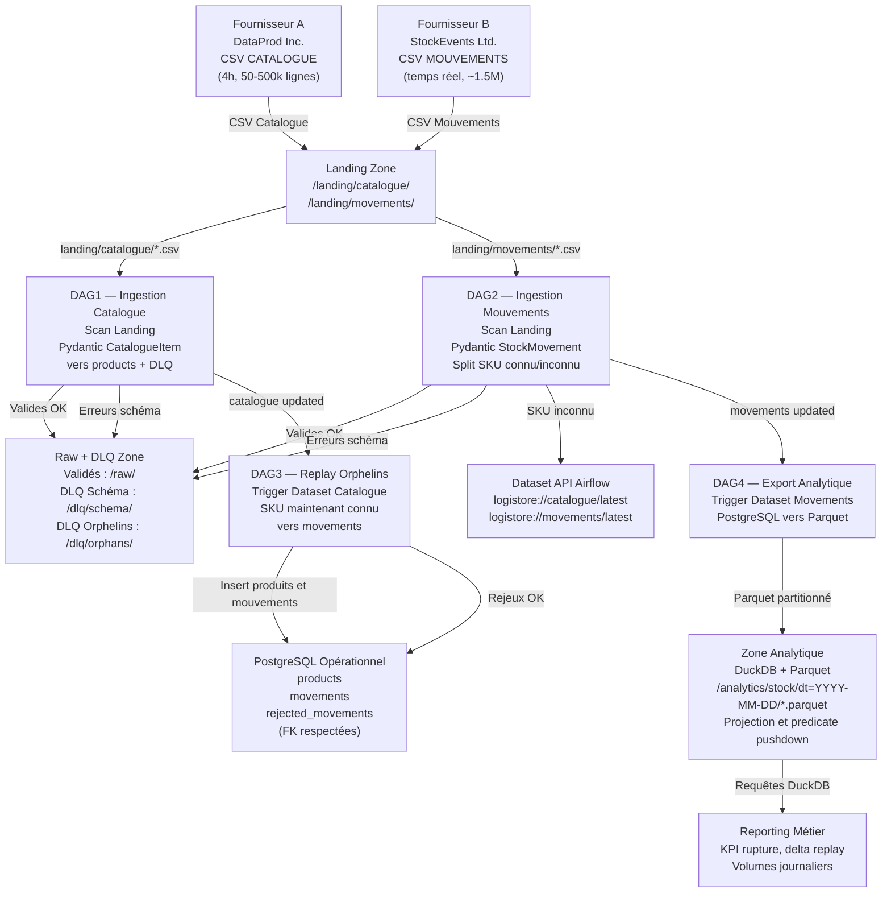

# Dossier d'Architecture — Projet LogiStore
## MSc 2 IA — Projet 6

---

## 1. Note de cadrage

### Contexte
LogiStore est un entrepôt logistique recevant des flux de données de deux fournisseurs :
- **Fournisseur A (DataProd Inc.)** : flux CSV CATALOGUE, toutes les 4h, 50-500k lignes
- **Fournisseur B (StockEvents Ltd.)** : flux CSV MOUVEMENTS, quasi temps réel, 200k à 800k lignes, pics à 1,5M

### Objectifs
1. Ingérer et valider les flux catalogue et mouvements via des contrats Pydantic versionnés
2. Gérer les mouvements orphelins (SKU inconnu) via une file de rejet et un mécanisme de rejeu
3. Alimenter une zone analytique Parquet pour les KPIs de stock
4. Benchmarker les performances SQL vs Parquet sur 3 paliers de volume

### Périmètre technique
- **Orchestration** : Apache Airflow 2.10 (DAG API + Dataset triggers)
- **Stockage opérationnel** : PostgreSQL 15
- **Stockage analytique** : Parquet + DuckDB
- **Validation** : Pydantic V2 (contrats versionnés)
- **Infrastructure** : Docker Compose
- **CI/CD** : GitHub Actions (ruff + pytest + benchmark)

---

## 2. Architecture générale



---

## 3. ERD — Modèle relationnel PostgreSQL

```
products
├── sku          PK (VARCHAR)
├── name         VARCHAR
├── category     VARCHAR
├── uom          VARCHAR
└── created_at   TIMESTAMP

movements
├── id              PK (SERIAL)
├── movement_id     UNIQUE VARCHAR
├── sku             FK → products.sku
├── movement_type   VARCHAR (IN/OUT)
├── quantity        INTEGER
├── reason          VARCHAR
└── occurred_at     TIMESTAMP

rejected_movements
├── id               PK (SERIAL)
├── movement_id      VARCHAR
├── sku              VARCHAR
├── movement_type    VARCHAR
├── quantity         INTEGER
├── reason           VARCHAR
├── occurred_at      TIMESTAMP
├── raw_payload      JSONB
├── rejection_reason VARCHAR
├── status           VARCHAR (PENDING / REPLAYED)
└── error_type       VARCHAR (schema / unknown_sku)
```

---

## 4. Flux de données détaillé

### DAG 1 — `ingest_catalogue`
- Déclencheur : `@hourly` + scan de `data/inbox/catalogue/`
- Lecture CSV avec `dtype={"schema_version": "string"}` *(fix pandas float cast)*
- Validation Pydantic `CatalogueRecordV1` / `CatalogueRecordV2` via `ContractVersionRegistry`
- UPSERT PostgreSQL table `products` (`ON CONFLICT DO UPDATE`)
- Export snapshot Parquet → `data/curated/catalogue_snapshot.parquet`
- Publication Dataset Airflow → déclenche DAG 2

### DAG 2 — `ingest_movements`
- Déclencheur : Dataset `catalogue_snapshot.parquet`
- Validation Pydantic `MovementRecordV1`
- Routage : SKU connu → `movements` / SKU inconnu → `rejected_movements` (status=`PENDING`)
- Append Parquet → `data/curated/movements_history.parquet`
- Publication Dataset Airflow → déclenche DAG 3

### DAG 4 — `replay_rejected_movements` *(à déclencher manuellement)*
- Déclencheur : manuel, après intégration d'un nouveau catalogue
- `fetch_pending_rejected()` : lit tous les `status='PENDING'`
- `filter_now_known_skus()` : croise avec `products`
- `replay_movements()` : INSERT dans `movements` + UPDATE `status='REPLAYED'` + append Parquet
- Ordre d'exécution : DAG 1 → DAG 4 → DAG 3 *(DAG 3 seul sans DAG 4 = KPIs incomplets)*

### DAG 3 — `inventory_analytics`
- Déclencheur : Dataset `movements_history.parquet`
- Requête DuckDB avec jointure catalogue + calcul `stock_status` :
  - `ALERT` si stock ≤ 0
  - `WARNING` si stock < `min_stock`
  - `OK` sinon
- Export rapport CSV → `data/reports/inventory_report_YYYYMMDD_HHMMSS.csv`

---

## 5. Analyse SQL vs Parquet

### Résultats benchmark (3 paliers)

| Requête | Palier | DuckDB/Parquet | PostgreSQL | Ratio |
|---|---|---|---|---|
| stock_by_sku | small | 11.65 ms | 23.54 ms | 2.0x |
| movements_by_month | small | 9.15 ms | 45.74 ms | 5.0x |
| stock_by_sku | medium | 11.50 ms | 22.06 ms | 1.9x |
| movements_by_month | medium | 9.03 ms | 42.70 ms | 4.7x |
| stock_by_sku | large | 12.70 ms | 21.61 ms | 1.7x |
| movements_by_month | large | 10.02 ms | 47.19 ms | 4.7x |

### Justification du double stockage

| Besoin | PostgreSQL | DuckDB/Parquet |
|---|---|---|
| Ingestion transactionnelle |  ACID, FK, contraintes |  |
| Gestion des rejets/rejeu |  SQL UPDATE natif |  |
| Requêtes analytiques |  2x à 5x plus lent |  Columnar, predicate pushdown |
| Scalabilité lecture |  Dégradation sans index |  Stable tous paliers |

---

## 6. Décisions techniques notables

| Décision | Justification |
|---|---|
| Pydantic V2 pour les contrats | Validation stricte, versionnage V1/V2, registre dynamique |
| `dtype={"schema_version": "string"}` dans DAG1 | Pandas cast `1.0` en float, rejeté par `Literal['1.0']` Pydantic |
| DAG 4 avant DAG 3 | DAG 3 dépend d'un Parquet complet — sans rejeu, les KPIs sont faux |
| `schedule=None` pour DAG 4 | Déclenchement manuel intentionnel après validation humaine |
| Airflow Dataset API | Couplage loose entre DAGs, pas de dépendances directes `trigger_dag_id` |
| `ON CONFLICT (movement_id) DO NOTHING` | Idempotence du rejeu — safe à re-déclencher |

---
